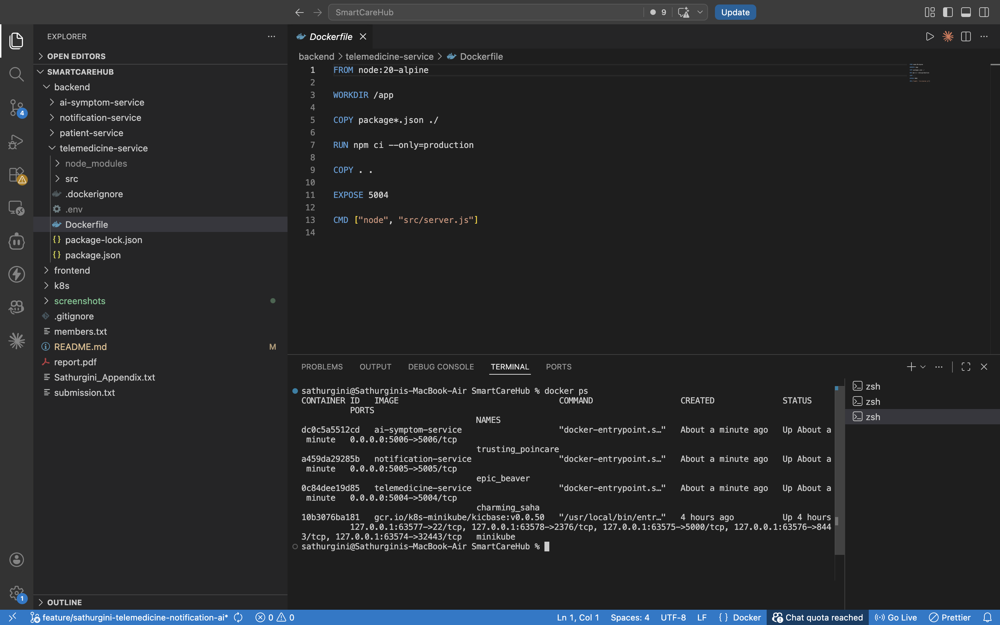
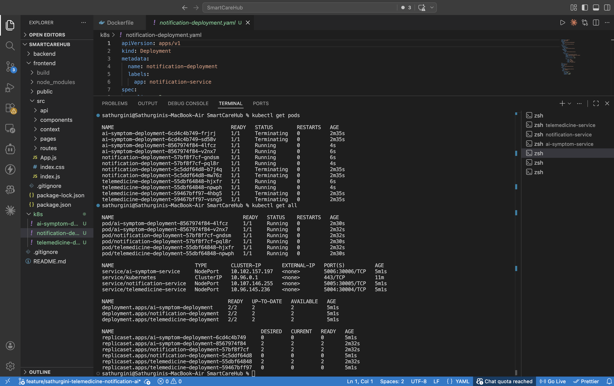
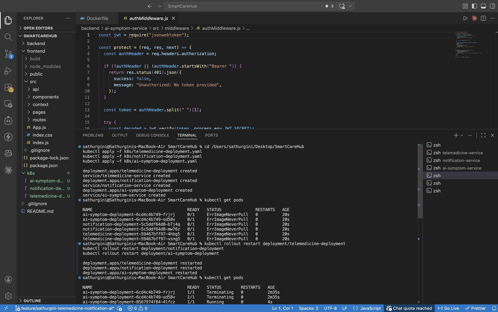
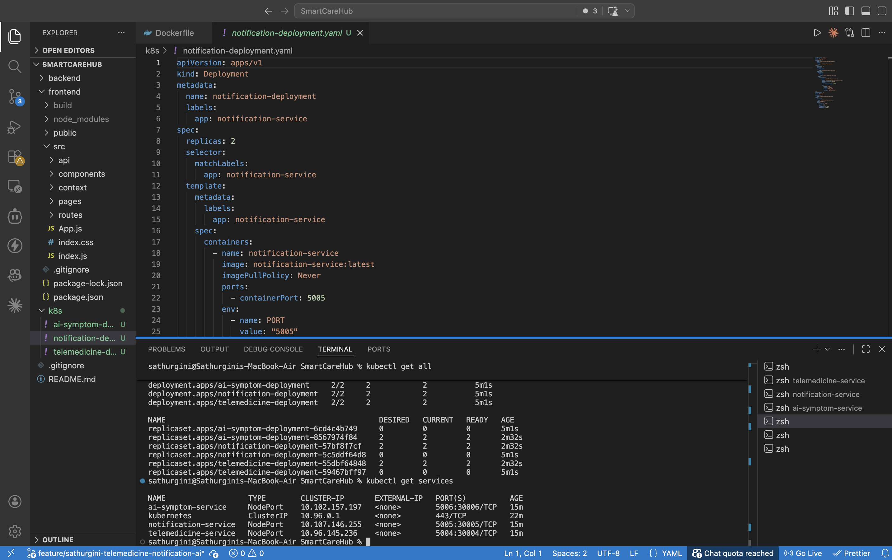

# SmartCareHub – Deployment Guide

SE3020 Distributed Systems  
Group: SE-51  
Member 4: Sathurgini Kalanantharasan (IT23534704)  

---

## 📌 Project Overview

SmartCareHub is a microservices-based healthcare platform consisting of:

- **Telemedicine Service** – Manages doctor appointments and consultations  
- **Notification Service** – Sends SMS and email alerts  
- **AI Symptom Service** – Provides symptom analysis using AI APIs  
- **Frontend (React)** – User interface for interaction  

---

## 🏗️ Architecture Overview

The system follows a microservices architecture:

User → React Frontend → Backend Services  
- AI Symptom Service → Analyze symptoms  
- Telemedicine Service → Book consultations  
- Notification Service → Send alerts  

All services communicate via REST APIs.

---

## ⚙️ Technologies Used

- Node.js (Backend)
- React (Frontend)
- MongoDB (Database)
- Docker (Containerization)
- Kubernetes (Orchestration)
- Groq API (AI)

---

## 📦 Prerequisites

Make sure the following are installed:

- Node.js (v18+)
- npm (v9+)
- Docker Desktop
- MongoDB (Local or Atlas)
- Git

For Kubernetes:
- Minikube
- kubectl

---

## 🔑 Required Environment Variables

Each service requires a `.env` file.

### Telemedicine Service

PORT=5004
MONGO_URI=your_mongodb_uri
JWT_SECRET=your_jwt_secret

### Notification Service
PORT=5005
MONGO_URI=your_mongodb_uri
JWT_SECRET=your_jwt_secret
TWILIO_ACCOUNT_SID=your_twilio_sid
TWILIO_AUTH_TOKEN=your_twilio_token
TWILIO_PHONE_NUMBER=your_number
EMAIL_USER=your_email
EMAIL_PASS=your_password

### AI Symptom Service
PORT=5006
MONGO_URI=your_mongodb_uri
JWT_SECRET=your_jwt_secret
GEMINI_API_KEY=your_key
GROQ_API_KEY=your_key

### Frontend

REACT_APP_TELEMEDICINE_URL=http://localhost:5004

REACT_APP_NOTIFICATION_URL=http://localhost:5005

REACT_APP_AI_SYMPTOM_URL=http://localhost:5006

---

## 🚀 Manual Deployment (Node.js)

### Step 1 – Clone Repository

git clone https://github.com/sathurgini01/SmartCareHub.git

cd SmartCareHub

### Step 2 – Install Dependencies
cd backend/telemedicine-service && npm install
cd ../notification-service && npm install
cd ../ai-symptom-service && npm install
cd ../../frontend && npm install

### Step 3 – Start MongoDB
(or use MongoDB Atlas)

### Step 4 – Run Backend Services

Open 3 terminals:
cd backend/telemedicine-service
npm start

cd backend/notification-service
npm start

cd backend/ai-symptom-service
npm start

### Step 5 – Run Frontend

cd frontend
npm start

Frontend: http://localhost:3000  

---

## 🐳 Docker Deployment

### Step 1 – Build Images
docker build -t telemedicine-service backend/telemedicine-service/
docker build -t notification-service backend/notification-service/
docker build -t ai-symptom-service backend/ai-symptom-service/
docker build -t frontend frontend/

### Step 2 – Run Containers

docker run -d -p 5004:5004 telemedicine-service
docker run -d -p 5005:5005 notification-service
docker run -d -p 5006:5006 ai-symptom-service
docker run -d -p 3000:3000 frontend
### Step 3 – Verify

docker ps

---

## 📦 Docker Compose (Optional)

docker-compose up --build

---

## ☸️ Kubernetes Deployment (Minikube)

### Step 1 – Start Minikube
minikube start

### Step 2 – Use Minikube Docker

eval $(minikube docker-env)

### Step 3 – Build Images

docker build -t telemedicine-service backend/telemedicine-service/
docker build -t notification-service backend/notification-service/
docker build -t ai-symptom-service backend/ai-symptom-service/

### Step 4 – Deploy Services
kubectl apply -f k8s/

### Step 5 – Check Status

kubectl get pods
kubectl get services

### Step 6 – Access Services

minikube service telemedicine-service
minikube service notification-service
minikube service ai-symptom-service

---

## 🔌 API Endpoints

### Telemedicine Service
- POST /appointments  
- GET /appointments/:id  

### Notification Service
- POST /notify/sms  
- POST /notify/email  

### AI Symptom Service
- POST /analyze-symptoms  

---

## 🤖 AI Functionality

The AI Symptom Service integrates:

- Google Gemini API  
- Groq API  

It:
- Analyzes user symptoms  
- Provides suggestions  
- Recommends medical specialists  

⚠️ This is not a medical diagnosis system.

---

## 📊 Port Summary

| Service | Port |
|--------|------|
| Telemedicine | 5004 |
| Notification | 5005 |
| AI Symptom | 5006 |
| Frontend | 3000 |

---

## 📸 Deployment Evidence

### 🐳 Docker Deployment Evidence

The microservices were successfully containerized and executed using Docker.

Figure 1: Docker containers running successfully using `docker ps`

---

### ☸️ Kubernetes Deployment Evidence

The system was deployed using Kubernetes (Minikube). All services and pods are running successfully.

#### Pods Status

Figure 2: Kubernetes pods in running state

#### All Resources

Figure 3: All Kubernetes resources (pods, services, deployments)

#### Services (NodePort)

Figure 4: Services exposed using NodePort

---

## 🛠️ Troubleshooting

**Issue: Service not starting**
- Check `.env` variables
- Check port conflicts

**Issue: MongoDB connection error**
- Verify MONGO_URI
- Ensure MongoDB is running

**Issue: API not working**
- Check backend services are running
- Verify frontend URLs

---

## 🔗 Repository

GitHub: https://github.com/sathurgini01/SmartCareHub.git  

---

## 📧 Contact

For any issues or inquiries:  
sathurgini@gmail.com

---