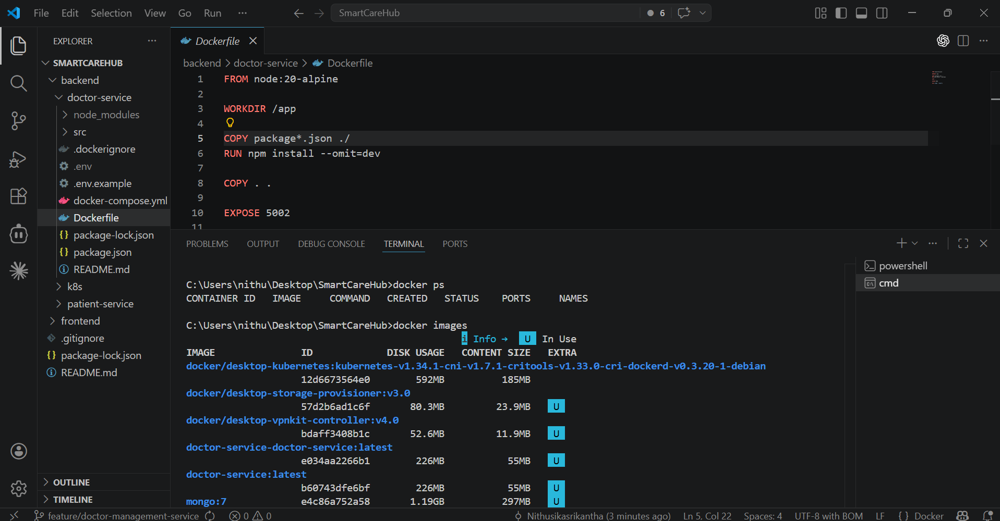
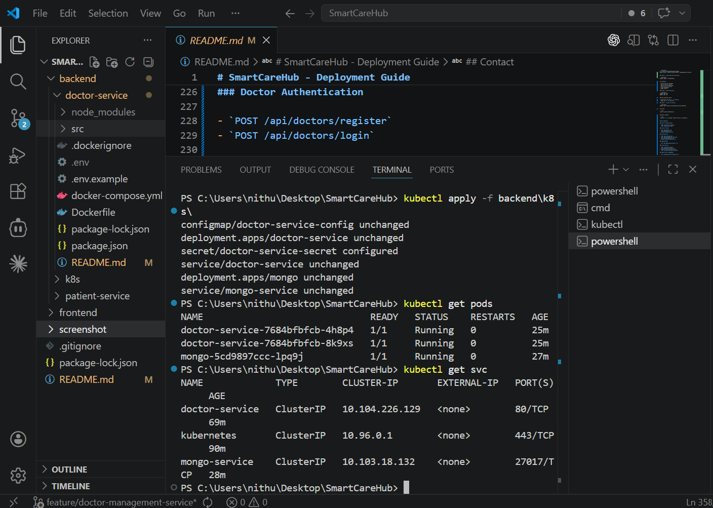
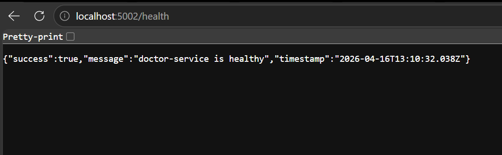

# SmartCareHub - Deployment Guide

SE3020 Distributed Systems  
Group: SE-51  
Contributor: Nithusika Srikantha  
Email: nithusika476@gmail.com

## Project Overview

SmartCareHub is a microservices-based healthcare platform built to support digital hospital workflows through a shared frontend and backend services.

This repository currently includes:

- Doctor Service - handles doctor registration, profile management, availability, appointments, and prescriptions
- Patient Service - contains patient-related backend work
- Frontend (React) - shared user interface for doctor and admin workflows
- Kubernetes manifests - deployment files for doctor-service and MongoDB

## Architecture Overview

The system follows a microservices architecture:

```text
User -> React Frontend -> Backend Services
```

Core flow in this module:

- Frontend -> Doctor Service for doctor and admin operations
- Doctor Service -> MongoDB for data persistence
- Kubernetes -> orchestrates doctor-service and MongoDB containers

All services communicate using REST APIs.

## Technologies Used

- Node.js
- Express.js
- React
- MongoDB
- Docker
- Kubernetes
- Mongoose

## Prerequisites

Make sure the following are installed:

- Node.js v18+
- npm
- Docker Desktop
- Kubernetes enabled in Docker Desktop
- kubectl
- Git
- MongoDB local instance or MongoDB through Docker/Kubernetes

## Required Environment Variables

### Doctor Service

Create a `.env` file in `backend/doctor-service/`:

```env
NODE_ENV=production
PORT=5002
MONGO_URI=mongodb://localhost:27017/doctor_service_db
JWT_SECRET=change_this_super_secret_key
JWT_EXPIRES_IN=1d
APPOINTMENT_SERVICE_MODE=mock
```

### Frontend

Create a `.env` file in `frontend/` if needed:

```env
REACT_APP_DOCTOR_API_URL=http://localhost:5002/api
```

## Manual Deployment

### Step 1 - Clone Repository

```powershell
git clone https://github.com/sathurgini01/SmartCareHub.git
cd SmartCareHub
```

### Step 2 - Install Dependencies

```powershell
cd backend\doctor-service
npm install

cd ..\..\frontend
npm install
```

### Step 3 - Start MongoDB

Use either:

- local MongoDB
- MongoDB Atlas
- Docker/Kubernetes MongoDB

### Step 4 - Run Doctor Service

```powershell
cd backend\doctor-service
npm start
```

Doctor service:

```text
http://localhost:5002/api
```

### Step 5 - Run Frontend

```powershell
cd frontend
npm start
```

Frontend:

```text
http://localhost:3000
```

## Docker Deployment

### Step 1 - Build Image

```powershell
cd C:\Users\nithu\Desktop\SmartCareHub
docker build -t doctor-service:latest .\backend\doctor-service
```

### Step 2 - Run with Docker Compose

```powershell
cd backend\doctor-service
docker compose up --build
```

### Step 3 - Verify Containers

```powershell
docker ps
```

## Kubernetes Deployment

This project was verified using Kubernetes enabled in Docker Desktop.

### Step 1 - Check Kubernetes

```powershell
kubectl version --client
kubectl cluster-info
kubectl get nodes
```

Expected:

- cluster should be available
- node should be `Ready`

### Step 2 - Build the Doctor Service Image

```powershell
cd C:\Users\nithu\Desktop\SmartCareHub
docker build -t doctor-service:latest .\backend\doctor-service
```

### Step 3 - Apply Kubernetes Manifests

```powershell
kubectl apply -f k8s\
```

This deploys:

- doctor-service configmap
- doctor-service secret
- doctor-service deployment
- doctor-service service
- mongo deployment
- mongo service

### Step 4 - Check Resources

```powershell
kubectl get pods
kubectl get svc
```

Healthy expected result:

- doctor-service pods -> `1/1 Running`
- mongo pod -> `1/1 Running`

### Step 5 - Access the Service

```powershell
kubectl port-forward service/doctor-service 5002:80
```

Then open:

```text
http://localhost:5002/health
```

Expected response:

```json
{"success":true,"message":"doctor-service is healthy"}
```

## API Endpoints

### Doctor Authentication

- `POST /api/doctors/register`
- `POST /api/doctors/login`

### Doctor Profile

- `GET /api/doctors/:id`
- `PUT /api/doctors/:id`
- `DELETE /api/doctors/:id`

### Availability

- `POST /api/availability`
- `GET /api/availability/:doctorId`
- `PUT /api/availability/:id`
- `DELETE /api/availability/:id`

### Appointments

- `GET /api/appointments/doctor/:id`

### Prescriptions

- `POST /api/prescriptions`
- `PUT /api/prescriptions/:id`
- `DELETE /api/prescriptions/:id`
- `GET /api/prescriptions/:doctorId`

### Admin Doctor Management

- `PUT /api/admin/doctors/approve/:id`
- `PUT /api/admin/doctors/reject/:id`
- `GET /api/admin/doctors`

## Module Features

This module focuses on doctor and admin functionality:

- doctor registration and login
- admin login flow
- doctor profile management
- doctor availability scheduling
- appointment request handling
- prescription CRUD
- admin doctor approval and rejection
- React dashboard UI for doctor and admin flows

## Port Summary

| Service | Port |
|---|---|
| Frontend | 3000 |
| Doctor Service | 5002 |
| MongoDB | 27017 |

## Deployment Evidence

### Docker Deployment Evidence



Figure 1: Docker containers running successfully using `docker ps`.

### Kubernetes Deployment Evidence



Figure 2: Kubernetes pods and services running successfully in Docker Desktop Kubernetes.

### Health Endpoint Evidence



Figure 3: Doctor service health endpoint responding successfully through `kubectl port-forward`.

## Troubleshooting

### Issue: ErrImagePull or ImagePullBackOff

Build the image locally first:

```powershell
docker build -t doctor-service:latest .\backend\doctor-service
```

### Issue: CrashLoopBackOff

Check logs:

```powershell
kubectl logs deployment/doctor-service
kubectl logs deployment/mongo
```

Restart deployment:

```powershell
kubectl rollout restart deployment doctor-service
```

### Issue: MongoDB connection error

- verify `MONGO_URI`
- ensure MongoDB is running
- ensure `mongo-service` exists in Kubernetes

### Issue: Service not reachable

- keep `kubectl port-forward` running
- verify pod status with `kubectl get pods`
- test `http://localhost:5002/health`

## Repository

GitHub: https://github.com/sathurgini01/SmartCareHub.git

## Contact

For issues or academic demonstration support:  
Nithusika Srikantha  
nithusika476@gmail.com
